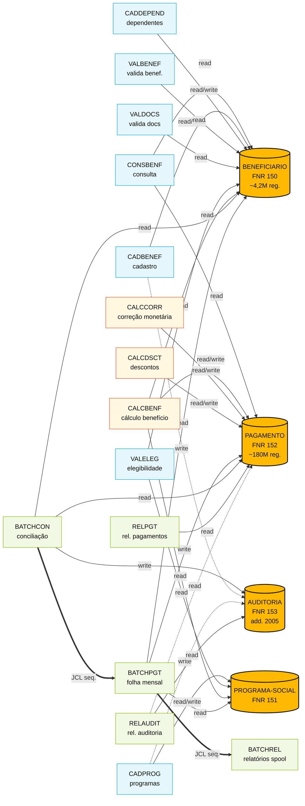
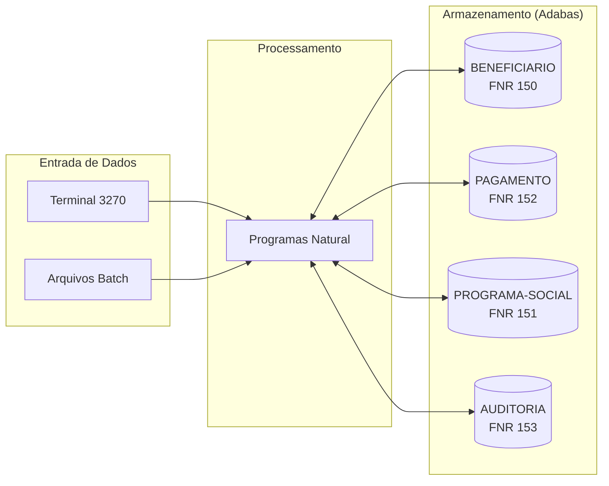

<!-- markdownlint-disable MD013 MD025 MD026 MD028 MD029 MD034 MD040 MD051 MD060 -->

# Mapa de Dependências — SIFAP Legado

  

> 🗺 **Você está aqui:** [Kit PT-BR](../README.md) → [Estágio 1](README.md) → **dependency-map**

> **Para quem é isto?** Este é um **artefato preenchido pelo time** durante o Estágio 1 (Arqueologia).
>
> **O que você terá ao final do estágio:**
>
> 1. Este documento totalmente preenchido com os dados reais do legado SIFAP
> 2. Rastreabilidade para `01-arqueologia/legado-sifap/` (programas `.NSN` e DDMs)
> 3. Base de evidência usada nas EARS do Estágio 2 (`source_legacy:`)
>
> 📘 **Guia passo a passo:** [`GUIDE.md`](GUIDE.md).

> Use diagramas Mermaid para mapear as dependências entre programas Natural e DDMs Adabas.
> O objetivo é visualizar "quem chama quem" e "quem lê/escreve o quê".

## Como descobrir dependências

- Use `grep` ou Copilot Chat para listar todas as ocorrências de `CALLNAT` nos 15 arquivos `.NSN`.
- Prompt útil: _"Liste todas as ocorrências de CALLNAT nestes arquivos e desenhe um diagrama Mermaid."_
- Para leitura/escrita em DDMs: procure por `READ`, `READ LOGICAL`, `STORE`, `UPDATE`, `DELETE`.

## Diagrama de Dependências entre Programas

> Substitua o exemplo abaixo pelo mapa real do seu time. **Meta:** cobrir todos os 15 programas, sem órfãos.

> **Nota arqueológica:** busca por `CALLNAT` nos 15 `.NSN` retornou **zero ocorrências**. O acoplamento real é **por dado** (DDMs compartilhados), não por contrato. Bounded contexts modernos têm que ser recortados pelo **dono do dado**, não pelo nome do programa.
>
> **Legenda:** 🟠 DDM Adabas · 🔵 online (3270) · 🟢 batch · 🟡 cálculo · aresta sólida = leitura/escrita confirmada · tracejada = escrita de auditoria inferida · `==>` = dependência temporal JCL/JES2.

## Diagrama de Fluxo de Dados (DDMs)

## Tabela de Dependências

| Programa | Chama (CALLNAT) | Lê (READ) DDMs | Escreve (STORE/UPDATE) DDMs | Observações |
| --- | --- | --- | --- | --- |
| CADBENEF.NSN | — (nenhum CALLNAT) | BENEFICIARIO | BENEFICIARIO, AUDITORIA | Cadastro online (3270); `PERFORM VALIDA-CPF` interno |
| CADDEPEND.NSN | — | BENEFICIARIO | BENEFICIARIO | Dependentes — mesmo agregado de BENEFICIARIO |
| CADPROG.NSN | — | PROGRAMA-SOCIAL | PROGRAMA-SOCIAL, AUDITORIA | IDs hardcoded; perfil ADM exigido; `PERFORM CONSULTA-PROG` |
| CONSBENF.NSN | — | BENEFICIARIO, PAGAMENTO | — | Read-only; `PERFORM MASCARA-CPF` interno (privacidade pré-LGPD) |
| VALBENEF.NSN | — | BENEFICIARIO | — | Validação online; duplica regra de VALDOCS (BR-027/BR-031) |
| VALDOCS.NSN | — | BENEFICIARIO | — | `PERFORM VALIDA-CPF-DOC`, `VALIDA-RG`, `CHECK-DOC-ESPECIAL` |
| VALELEG.NSN | — | BENEFICIARIO, PROGRAMA-SOCIAL | — | `PERFORM VERIF-ELEG-ESPECIFICA`; consulta programa social |
| CALCBENF.NSN | — | BENEFICIARIO, PROGRAMA-SOCIAL, PAGAMENTO | PAGAMENTO | `PERFORM DET-FAIXA-RENDA`; coração do cálculo |
| CALCCORR.NSN | — | PAGAMENTO | PAGAMENTO | Correção monetária TR/IGP-M hardcoded |
| CALCDSCT.NSN | — | PAGAMENTO | PAGAMENTO | `PERFORM CALC-CONTRIB-SOCIAL` |
| BATCHCON.NSN | — | BENEFICIARIO, PAGAMENTO | AUDITORIA | `PERFORM GRAVA-AUDITORIA-DIVERG/CONC`; antecede BATCHPGT no JCL |
| BATCHPGT.NSN | — | BENEFICIARIO, PROGRAMA-SOCIAL | PAGAMENTO | `PERFORM DET-FAIXA-RENDA-BATCH`; folha mensal — job mais crítico |
| BATCHREL.NSN | — | PAGAMENTO | — | `PERFORM IMPRIME-CABECALHO`; relatório spool 132 col. |
| RELPGT.NSN | — | PAGAMENTO | — | `PERFORM IMPRIME-CABECALHO/SUBTOTAL`; rel. mensal |
| RELAUDIT.NSN | — | AUDITORIA, PAGAMENTO | — | `PERFORM IMPRIME-CAB-AUDIT`; consulta trilha por período/usuário |

## Dependências Circulares

> Liste aqui qualquer dependência circular encontrada (programa A chama B que chama A):

- **Nenhuma — impossível por construção.** Não existe nenhum `CALLNAT` nos 15 `.NSN` (busca exaustiva confirmada). Sem chamadas inter-programa, não há ciclo possível na camada Natural.
- ⚠️ Existem **ciclos lógicos por dado**: `BATCHPGT` escreve em `PAGAMENTO` → `BATCHCON` lê `PAGAMENTO` e escreve em `AUDITORIA` → `RELAUDIT` lê `AUDITORIA`. Não é ciclo no sentido clássico (cada job é independente), mas a cadeia JCL cria dependência temporal forte.

## Programas Órfãos

> Programas que não são chamados por nenhum outro (possíveis pontos de entrada ou código morto):

- **Todos os 15 programas são pontos de entrada independentes.** Como não há `CALLNAT`, formalmente todos são "órfãos" no sentido Natural — nenhum é chamado por outro `.NSN`.
- O agrupamento operacional ocorre fora do Natural:
  - **Online (3270 / Com\*complete):** `CONSBENF`, `CADBENEF`, `CADDEPEND`, `CADPROG`, `VALBENEF`, `VALDOCS`, `VALELEG` são invocados por menu/transação 3270.
  - **Batch (JCL/JES2):** `BATCHCON` → `BATCHPGT` → `BATCHREL` formam a cadeia mensal; `RELPGT` e `RELAUDIT` são jobs sob demanda.
  - **Cálculo (`CALCBENF`, `CALCCORR`, `CALCDSCT`):** rodam embutidos em `BATCHPGT` via JCL (não via Natural).
- **Sem código morto detectado** — todos os 15 programas têm uso documentado em pelo menos um fluxo operacional.

---

### Continuar a leitura

<table width="100%">
<tr>
<td width="50%" valign="top" align="left">
<strong>← ANTERIOR</strong> 
<a href="business-rules-catalog.md"><strong>business-rules-catalog.md</strong></a> 
Catálogo de regras.
</td>
<td width="50%" valign="top" align="right">
<strong>PRÓXIMO →</strong> 
<a href="discovery-report.md"><strong>discovery-report.md</strong></a> 
Síntese final.
</td>
</tr>
</table>

↑ <a href="README.md">Voltar ao Kit PT-BR</a>

