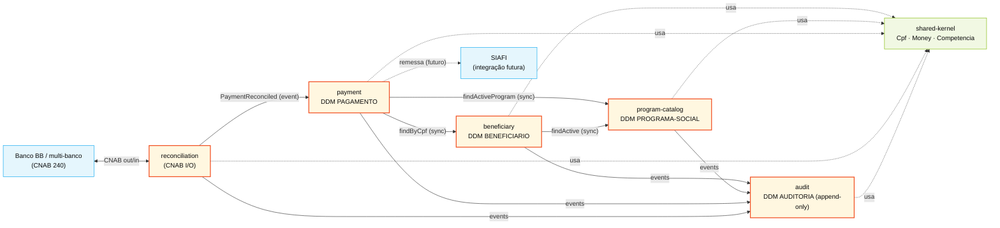

<!-- markdownlint-disable MD013 MD025 MD026 MD028 MD029 MD034 MD040 MD051 MD060 -->

# Mapa de Bounded Contexts — SIFAP 2.0

  

> **Origem:** [`01-arqueologia/dependency-map.md`](../01-arqueologia/dependency-map.md), [`01-arqueologia/business-rules-catalog.md`](../01-arqueologia/business-rules-catalog.md), [`scope-decisions.md`](scope-decisions.md).

## Princípio de recorte

O legado SIFAP **não tem `CALLNAT`** entre os 15 programas Natural — todo o acoplamento real ocorre via **DDMs Adabas compartilhados**. Acoplamento por dado, não por contrato. Portanto:

> **Recortamos bounded contexts pelo dono do dado, não pela similaridade de função.** Quem escreve em um DDM é o dono; demais módulos só leem via interface pública.

Critérios aplicados:

1. **Coesão por agregado raiz** — entidades que mudam juntas ficam juntas.
2. **Acoplamento por evento, não por tabela** — contextos publicam eventos de domínio em vez de fazer JOIN cross-context.
3. **Frequência de mudança** — regras com cadências diferentes (cadastro vs cálculo vs auditoria) viram contextos separados.
4. **Linguagem ubíqua** — "beneficiário" significa o mesmo em todo o contexto; "pagamento" significa coisas diferentes em `payment` e `reconciliation` (forte sinal de fronteira).

---

## Avaliações de Hipóteses

### Hipótese A — 1 contexto por programa Natural (15 contextos) — **REJEITADO**

| Critério              | Avaliação                                              | Evidência                                                                                          |
| --------------------- | ------------------------------------------------------ | -------------------------------------------------------------------------------------------------- |
| Coesão                | **Baixa** — `CADBENEF` e `CADDEPEND` operam o mesmo agregado | `dependency-map.md` mostra ambos R/W em `BENEFICIARIO` (FNR 150) e seu PE de dependentes           |
| Acoplamento           | **Inviável** — exige 15 microsserviços que compartilham DB | `dependency-map.md` §"Acoplamento via PAGAMENTO": 7 programas leem/escrevem o mesmo DDM            |
| Frequência de mudança | Heterogênea, mas funde regras irmãs em módulos anêmicos | Sem ganho prático — replica o problema do legado em embalagem nova                                 |

**Rejeitado:** gera 15 módulos anêmicos com transações distribuídas desnecessárias.

### Hipótese B — 1 contexto monolítico (sem fronteiras internas) — **REJEITADO**

| Critério              | Avaliação                                                      | Evidência                                                                                          |
| --------------------- | -------------------------------------------------------------- | -------------------------------------------------------------------------------------------------- |
| Coesão                | Alta no papel, baixa na prática — repete pacote-por-camada legado | Anti-padrão que o próprio `dependency-map.md` denuncia ("acoplamento por dado")                    |
| Acoplamento           | Tudo importa tudo — perde valor do exercício de modernização    | `discovery-report.md §3.2` lista 8 pontos de cascata por dado                                      |
| Frequência de mudança | Mudança em `CALCDSCT` força redeploy de telas de cadastro       | Bloqueia entrega independente; quebra `scope-decisions` que prevê evolução por feature             |

**Rejeitado:** perde clareza arquitetural e bloqueia extração futura.

### Hipótese C — Fundir `reconciliation` em `payment` (4 contextos) — **REJEITADO**

| Critério              | Avaliação                                                                       | Evidência                                                                          |
| --------------------- | ------------------------------------------------------------------------------- | ---------------------------------------------------------------------------------- |
| Coesão                | Parece alta — ambos mexem em `PAGAMENTO`                                        | `BATCHCON.NSN` lê PAGAMENTO mas só altera **status** e `COD-BANCO`                 |
| Acoplamento           | Médio — `reconciliation` é I/O externo (CNAB 240) com ritmo de release diferente | `BATCHCON` roda diário; `BATCHPGT` roda mensal                                     |
| Frequência de mudança | **Diverge** — adicionar banco novo (Multi-banco MYS-005) não deveria mexer no motor de cálculo | Layout CNAB muda por banco; fórmula BR-017 muda por lei federal                    |

**Rejeitado:** mesmo dado, ciclos de vida e cadências distintos. Separar facilita o cutover (`payment` em paralelo com `reconciliation` legado por mais tempo).

### Hipótese D — Recortar por dono do dado (5 contextos + shared-kernel) — **ACEITO**

| Critério              | Avaliação                                                                                                | Evidência                                                              |
| --------------------- | -------------------------------------------------------------------------------------------------------- | ---------------------------------------------------------------------- |
| Coesão                | Alta — cada contexto possui 1 DDM principal e regras correlatas                                          | Mapeamento DDM→contexto: 1:1 + AUDITORIA cross-cutting                 |
| Acoplamento           | Baixo — comunicação por eventos de domínio + interface pública leitura-only                              | Padrão Modular Monolith (`.github/instructions/modular-monolith.md`)   |
| Frequência de mudança | Alinhada — `beneficiary` muda por LGPD, `payment` por lei fiscal, `audit` por compliance — independentes | `scope-decisions.md` prioriza Evoluir em fronteira clara               |

**Aceito** como recorte oficial.

---

## Bounded Contexts Finais

### 1. `beneficiary`

- **Responsabilidade:** ciclo de vida do beneficiário e dependentes; validações de documento e elegibilidade (consolidando VAL*).
- **Dados sob ownership:** `BENEFICIARIO` (FNR 150) + grupo periódico de dependentes; tabelas de validação (regras CPF/RG/NIS).
- **Interface pública:** `BeneficiaryQuery` (read-only: findByCpf, findByNis), `BeneficiaryCommand` (register, update, suspend, addDependent), evento `BeneficiaryStatusChanged`.
- **Programas legados absorvidos:** `CADBENEF`, `CADDEPEND`, `CONSBENF`, `VALBENEF`, `VALDOCS`, `VALELEG`.
- **Por que é seu próprio contexto:** dono único de identidade da pessoa; consolidar VAL* aqui resolve duplicação BR-027/031 (motor único de validação).

### 2. `program-catalog`

- **Responsabilidade:** catálogo de programas sociais e regras de elegibilidade específicas por programa.
- **Dados sob ownership:** `PROGRAMA-SOCIAL` (FNR 151); tabela de versões de `VLR-BASE` e `FATOR-REAJUSTE`.
- **Interface pública:** `ProgramQuery` (findActive, findById), `ProgramCommand` (create, updateBaseValue, deactivate), evento `ProgramActivated/Deactivated`.
- **Programas legados absorvidos:** `CADPROG`; lógica de elegibilidade de `VALELEG` que depende de programa.
- **Por que é seu próprio contexto:** catálogo muda em cadência política (decreto), independente de cadastro de pessoa ou de cálculo mensal; isolar permite versionar programas sem redeploy do motor.

### 3. `payment`

- **Responsabilidade:** geração da folha mensal, cálculo de benefício (BR-017), aplicação de descontos (via `CALCDSCT`), correção monetária, idempotência mensal.
- **Dados sob ownership:** `PAGAMENTO` (FNR 152) — ~180M registros; tabelas de índice IPCA externalizadas (N10).
- **Interface pública:** `PaymentQuery` (findByCompetencia, findByBeneficiary), `PaymentBatch` (generateCycle, runCorrection), evento `PaymentGenerated/Updated`.
- **Programas legados absorvidos:** `CALCBENF`, `CALCDSCT`, `CALCCORR`, `BATCHPGT`, `BATCHREL`, `RELPGT`.
- **Por que é seu próprio contexto:** coração financeiro do sistema; mudança aqui exige shadow test (R1). Idempotência (BR-012) e fórmula-mãe (BR-017) são invariantes que precisam de uma única casa.

### 4. `reconciliation`

- **Responsabilidade:** importar retorno bancário CNAB 240, conciliar com pagamentos gerados, atualizar status (P/D/E), tratar exceções (resolve MYS-006).
- **Dados sob ownership:** arquivos CNAB recebidos (staging tables); **publica eventos** `PaymentReconciled/Rejected/Diverged` consumidos por `payment` (que atualiza status).
- **Interface pública:** `ReconciliationCommand` (importCnabFile, retryUnknownReturns), `ReconciliationQuery` (listDivergences); consome `PaymentGenerated`.
- **Programas legados absorvidos:** `BATCHCON`.
- **Por que é seu próprio contexto:** I/O com sistema externo (BB hoje, multi-banco amanhã — fim do MYS-005); cadência diária ≠ ciclo mensal de `payment`; falha aqui não pode parar geração de folha.

### 5. `audit`

- **Responsabilidade:** trilha append-only de todas as operações sensíveis (CRUD de beneficiário, transição de status de pagamento, conciliação); hash-chain para não-adulteração (N8); relatório CGU/TCU.
- **Dados sob ownership:** `AUDITORIA` (FNR 153) — adicionado em 2005, agora ampliado para incluir exclusões (resolve MYS-018).
- **Interface pública:** consome todos os eventos de domínio dos demais contextos; `AuditQuery` (findByPeriod, findByUser, verifyChain).
- **Programas legados absorvidos:** `RELAUDIT` + escrita de auditoria embutida em `BATCHCON`, `CADBENEF`, `CADPROG`.
- **Por que é seu próprio contexto:** requisito de compliance (LGPD/CGU) não pode depender da disponibilidade dos outros módulos; append-only com retenção de 5 anos exige modelo de dados próprio.

### 6. `shared-kernel` (kernel compartilhado, **não** é um contexto autônomo)

- **Conteúdo:** value objects atômicos do domínio: `Cpf` (com validação módulo-11 sem backdoor), `Nis`, `Money` (BigDecimal escala 2, HALF_EVEN — ADR-002), `Competencia` (AAAAMM), `Cnpj`, enums (`StatusBeneficiario`, `StatusPagamento`, `TipoDesconto`).
- **Regras de evolução:** mudança aqui requer aprovação dos 5 contextos; versionado semanticamente; nunca contém lógica de processo, só tipos imutáveis.
- **Por que não é contexto:** não tem ciclo de vida nem agregado — é vocabulário.

---

## Comunicação Entre Contextos

| De              | Para              | Mecanismo                      | Dados                                                                           |
| --------------- | ----------------- | ------------------------------ | ------------------------------------------------------------------------------- |
| `payment`       | `beneficiary`     | Chamada síncrona (read-only)   | `findByCpf(cpf)` → `BeneficiaryDto` (status, dependentes, renda)                |
| `payment`       | `program-catalog` | Chamada síncrona (read-only)   | `findActiveProgram(id)` → `ProgramDto` (vlrBase, fatorReajuste, tipo)           |
| `payment`       | `audit`           | Evento de domínio (assíncrono) | `PaymentGenerated`, `PaymentStatusChanged` (paymentId, oldStatus, newStatus)    |
| `reconciliation`| `payment`         | Evento de domínio (assíncrono) | `PaymentReconciled` (paymentId, codRetorno, newStatus) → handler atualiza       |
| `reconciliation`| `audit`           | Evento de domínio (assíncrono) | `ReconciliationCompleted`, `ReconciliationDiverged`                             |
| `beneficiary`   | `audit`           | Evento de domínio (assíncrono) | `BeneficiaryRegistered`, `BeneficiaryStatusChanged`, `DependentAdded`           |
| `program-catalog`| `audit`          | Evento de domínio (assíncrono) | `ProgramCreated`, `ProgramBaseValueUpdated`                                     |
| `beneficiary`   | `program-catalog` | Chamada síncrona (read-only)   | `findActive()` para validação de elegibilidade                                  |
| Todos           | `shared-kernel`   | Dependência de biblioteca      | Value objects (`Cpf`, `Money`, `Competencia`)                                   |

**Padrão geral:** leituras cross-context são síncronas via interface pública; escritas nunca cruzam fronteira — só eventos. `audit` é puro consumidor (sink).

---

## Mapeamento DDM → Contexto

| DDM legado (FNR)             | Contexto moderno   | Ownership | Notas de mapeamento                                                    |
| ---------------------------- | ------------------ | --------- | ---------------------------------------------------------------------- |
| `BENEFICIARIO` (150)         | `beneficiary`     | Exclusivo | PE de dependentes → `@OneToMany Dependent`; MU de endereços → `jsonb`  |
| `PROGRAMA-SOCIAL` (151)      | `program-catalog` | Exclusivo | Versionamento de `VLR-BASE` em tabela `program_base_value_history`     |
| `PAGAMENTO` (152) — ~180M    | `payment`         | Exclusivo | Particionar por `competencia` (AAAAMM); MU de parcelas → tabela filha  |
| `AUDITORIA` (153)            | `audit`           | Exclusivo | Append-only; coluna `prev_hash` + `row_hash` para hash-chain (N8)      |

---

## Definition of Done (este arquivo)

- [x] 4 hipóteses avaliadas, 3 explicitamente rejeitadas
- [x] 5 contextos nomeados + shared-kernel
- [x] Cada contexto tem responsabilidade, ownership, interface pública, programas absorvidos e justificativa
- [x] Tabela de comunicação preenchida (9 fluxos)
- [x] Diagrama Mermaid renderizando
- [x] Mapeamento DDM → contexto explícito
