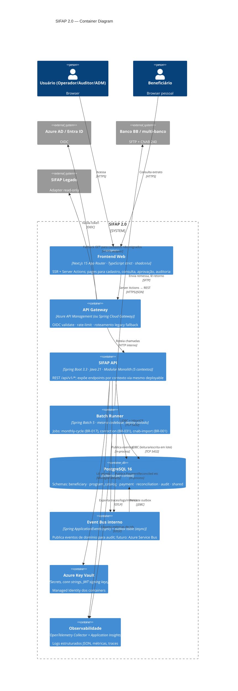

<!-- markdownlint-disable MD013 MD025 MD026 MD028 MD029 MD034 MD040 MD051 MD060 -->

# C4 Nível 2 — Containers — SIFAP 2.0

 

> **Pré-requisito:** [`c4-context.md`](c4-context.md) e ADR-0001 (Modular Monolith).

## Diagrama

## Containers

| Container        | Tecnologia                                                   | Responsabilidade                                                                                |
| ---------------- | ------------------------------------------------------------ | ----------------------------------------------------------------------------------------------- |
| Frontend Web     | Next.js 15 App Router, TypeScript strict, Tailwind, shadcn/ui| UI para cadastro, consulta, aprovação, auditoria. Server Components + Server Actions.            |
| API Gateway      | Azure API Management ou Spring Cloud Gateway                 | OIDC validate, rate-limit, roteamento Strangler para legado quando contexto não migrado.        |
| SIFAP API        | Spring Boot 3.3, Java 21 (virtual threads), Spring Modulith | Modular Monolith com 5 contextos; expõe REST `/api/v1/*`; transações ACID locais.               |
| Batch Runner     | Spring Batch 5 (mesma codebase, profile distinto)            | `monthly-cycle` (BR-017), `cnab-import` (BR-001), `correction` (BR-031). Resumível via checkpoint. |
| PostgreSQL 16    | Azure Database for PostgreSQL Flexible Server                | Schema-per-context; particionamento por `competencia` em `payment.payment`; backups PITR.        |
| Event Bus        | Spring `ApplicationEvents` + tabela outbox                   | Eventos de domínio sync no contexto + async via outbox → `audit`. Futuro: Azure Service Bus.     |
| Key Vault        | Azure Key Vault                                              | Secrets, connection strings, chaves de assinatura JWT. Acesso via Managed Identity.              |
| Observabilidade  | OpenTelemetry Collector + Azure Application Insights         | Traces W3C, logs JSON estruturados, métricas custom (incluindo NFR-004).                         |

## Decisões de design embutidas

- **Mesma codebase para API e Batch.** Compartilham domínio e repositórios. Profile Spring (`api` vs `batch`) controla quais beans sobem. Evita drift de regra entre online e batch (resolve MYS-024 em outro eixo).
- **API Gateway com fallback Strangler.** Permite migrar contextos um a um sem alterar o frontend (URL é estável).
- **Outbox pattern para eventos para `audit`.** Garante exactly-once mesmo se evento falha após commit; consumer próprio do `audit` lê o outbox.
- **Sem messaging externo no MVP.** Spring `ApplicationEvents` é suficiente dentro do monolito; preserva ACID. Service Bus entra quando extrairmos contexto.
- **Frontend com Server Actions** para mutações: secret nunca vaza para o browser; segue convenção [`.github/instructions/frontend-spec.instructions.md`](../../.github/instructions/frontend-spec.instructions.md).

## Deployment alvo (preview — ADR futuro)

| Componente   | Azure resource                                | Notas                                                       |
| ------------ | --------------------------------------------- | ----------------------------------------------------------- |
| Frontend     | Azure Static Web Apps                         | Build artefacts publicados via GitHub Actions               |
| API          | Azure Container Apps (1 réplica → autoscale)  | Java 21 imagem; injeta Managed Identity                     |
| Batch        | Azure Container Apps Jobs (event-trigger)     | Cron mensal; SFTP polling diário                            |
| Postgres     | Azure DB for PostgreSQL Flexible Server (HA)  | Private endpoint; backups PITR 35d                          |
| Key Vault    | Azure Key Vault Standard                      | RBAC + access policies                                      |
| Observ.      | Application Insights + Log Analytics          | Workspace dedicado por env                                  |
| Gateway      | Azure API Management Consumption tier         | Política de roteamento Strangler em policy.xml              |
