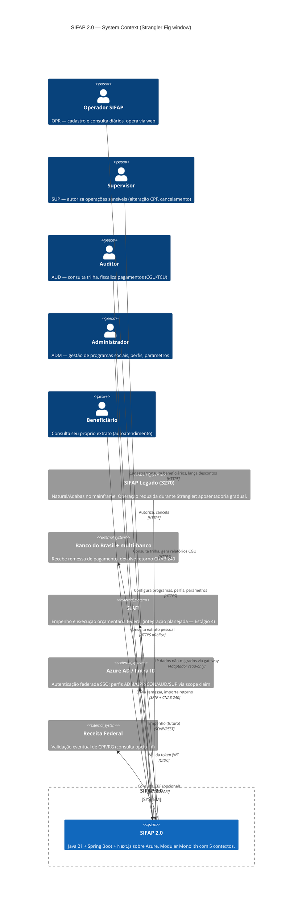

<!-- markdownlint-disable MD013 MD025 MD026 MD028 MD029 MD034 MD040 MD051 MD060 -->

# C4 Nível 1 — System Context — SIFAP 2.0

 

> **Período retratado:** janela de Strangler Fig — SIFAP 2.0 em operação paralela ao SIFAP legado.

## Diagrama

## Atores

| Ator           | Perfil legado | Capacidades principais                                                          |
| -------------- | ------------- | ------------------------------------------------------------------------------- |
| Operador       | OPR           | Cadastro/atualização de beneficiário, consulta, lançamento de descontos          |
| Supervisor     | SUP           | Aprovação de operações sensíveis (alteração CPF, cancelamento de pagamento)     |
| Auditor        | AUD           | Consulta trilha de auditoria com mascaramento controlado, relatórios CGU/TCU    |
| Administrador  | ADM           | Cadastro/manutenção de programas sociais, parâmetros do sistema                 |
| Beneficiário   | (novo — N2)   | Autoatendimento: consulta extrato pessoal (greenfield, não existe no legado)    |

## Sistemas externos

| Sistema           | Direção  | Protocolo            | Notas                                                                                       |
| ----------------- | -------- | -------------------- | ------------------------------------------------------------------------------------------- |
| Azure AD / Entra  | in       | OIDC / OAuth2        | Substitui autorização interna do Com-plete; perfis no scope claim                           |
| Banco BB + outros | bidir    | SFTP + CNAB 240      | Saída: remessa; entrada: retorno. Multi-banco habilitado (fim do `COD-BANCO=1` MYS-005)     |
| Receita Federal   | out      | HTTPS                | Consulta opcional de CPF — não bloqueia cadastro                                            |
| SIAFI             | out      | SOAP/REST            | Empenho e execução orçamentária — entra no Estágio 4 (escopo de evolução)                   |
| SIFAP Legado      | bidir RO | Adapter via gateway  | Leitura de dados não migrados durante Strangler; nenhuma escrita                            |

## Estratégia Strangler Fig

Durante o cutover, `SIFAP 2.0` coexiste com legado:

1. **Fase 1 — read-through:** todo POST/PUT vai para SIFAP 2.0; GET fallback para legado se contexto ainda não migrado.
2. **Fase 2 — write-through dual:** escritas em `beneficiary` vão para os dois sistemas (legado em modo somente-leitura para leitura cruzada).
3. **Fase 3 — cutover por contexto:** `audit` primeiro (baixo risco), depois `beneficiary`, `program-catalog`, `reconciliation` e finalmente `payment` (mais arriscado por causa de BR-017).
4. **Fase 4 — aposentadoria:** legado em modo emergência por 1 ciclo mensal completo; depois desligado.

Métrica de bloqueio (NFR-004): `payment.cycle.diff_vs_legacy_centavos` precisa ficar em zero por 3 ciclos antes do cutover de `payment`.
